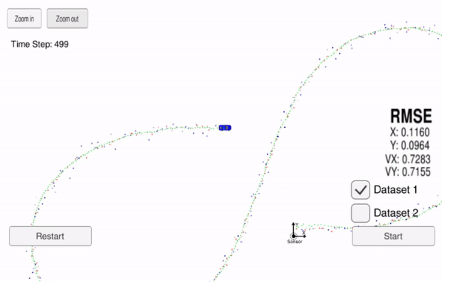
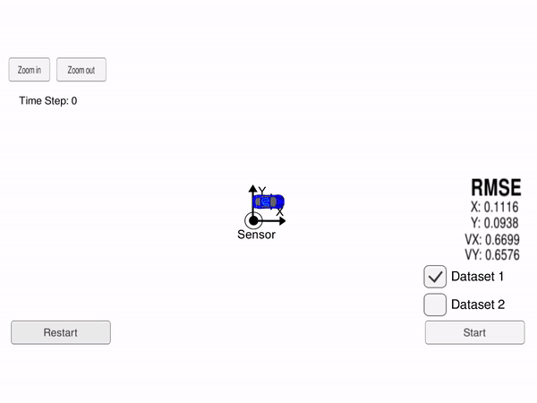

#### Udacity Self-driving Car Nanodegree
# Project 5: Extended Kalman Filter - Sensor Fusion 

## Extended Kalman Filter (Self-Driving Car Engineer Nanodegree)

In this project, a kalman filter is utilized to estimate the state of a moving object of interest with noisy lidar and radar measurements.


#### Dependencies

* cmake >= 3.5
* make >= 4.1 (Linux, Mac), 3.81 (Windows)
* gcc/g++ >= 5.4
* [uWebSocketIO](https://github.com/uWebSockets/uWebSockets) with commit hash e94b6e1


#### Build
The Extended Kalman Filter program can be built and run by doing the following from the project top directory.

```bash
$> mkdir build
$> cd build
$> cmake ..
$> make
```

#### Run
Run from the project top directory.
```bash
$> build/ExtendedKF
```


## Overview
This is an project of state estimation of a moving object using data from lidar and radar sensrs.
State is an matrix consisting of position and velocity of a moving object, here we are estimating this in 2D, so the state vector consist of (px,y,vx,vy).However kalaman filters are not only restricted to 2D it can be applied to 1D as well as 3D.
Following image shows an example result of the estimate: 



Here the green traiangle represents the estimated path , red one is for the Lidar measurment and Blue is for the redar measurment .


Our goal is to use Kalman Filter for Lidar measurement  and Extended Klaman Filter for Radar measurement to estimate the state (position and velocity), with RMSE (Root Mean Square Eroor) less that a given upper bound and as low as possible. 


This project involves the Udacity Self-Driving Car Engineer Nanodegree Term 2 Simulator for generating the simulated measumrment and presenting result. Simulator can be downloaded [here](https://github.com/udacity/self-driving-car-sim/releases).


* # L(for laser) meas_px meas_py timestamp gt_px gt_py gt_vx gt_vy

* # R(for radar) meas_rho meas_phi meas_rho_dot timestamp gt_px gt_py gt_vx gt_vy


The simulator sends each line of measurement over a WebSocket connection to our code. The Extended Kalman Filter is implemented in the `FusionEKF` class. The `main()` method prepares a `measurement_package` from the input of the simulator (coming over the WebSocket) and calls `fusionEKF.ProcessMeasurement(meas_package)`. The RMSE is then calculated from the result of state estimation and the ground truth and the estimated state and the RMSE values for position and velocity are returned to the simulator for presentation. 

The overall flow of the sensor fusion with KF and EKF is shown below: 

* Have a lookn at code for better understanding </br>
* If the incoming measurement is the very first one, the state vector is initialized. Other functions like transition function,
process covariance matrix , measurement function  and measurement covariance matrix  for Lidar measurements, and the measurement covariance matrix are 
inside the class.</br>
The measurment function is non linear for Radar so we have to initilise its jacobian too.

For the consequent measurements the Prdict-Update cycle of the Kalman filter is performed: 


* First predict step is carried out of calculate the new state transition function and also to porcess the covariance matices

* Then measurment step is carried out for both the radar and lidar data.Radar data is processed using Extended Kalman Filter while radar is processed using Linear Kalman Filters

# Here are the Results.


