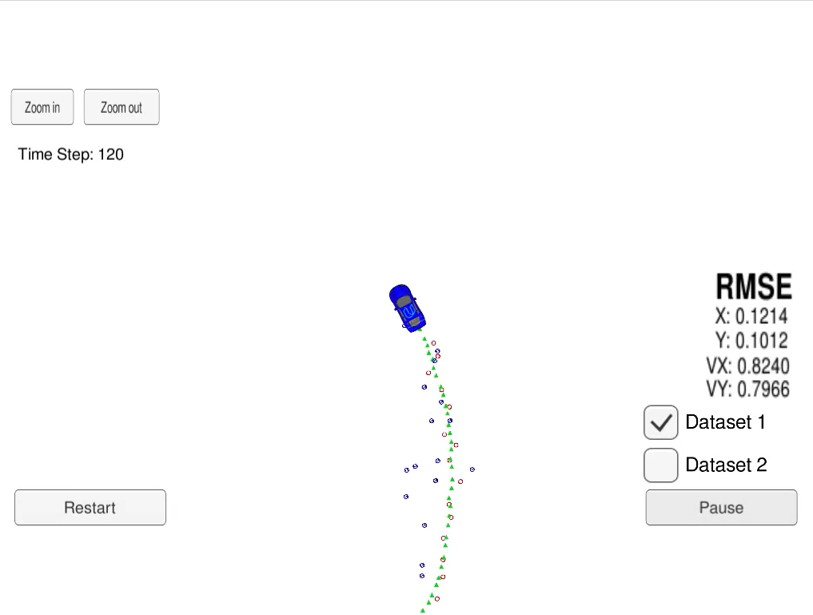
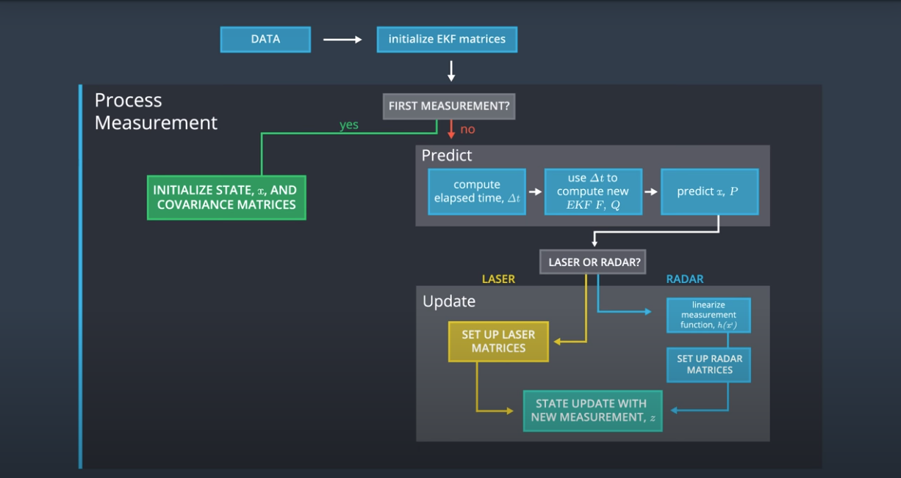
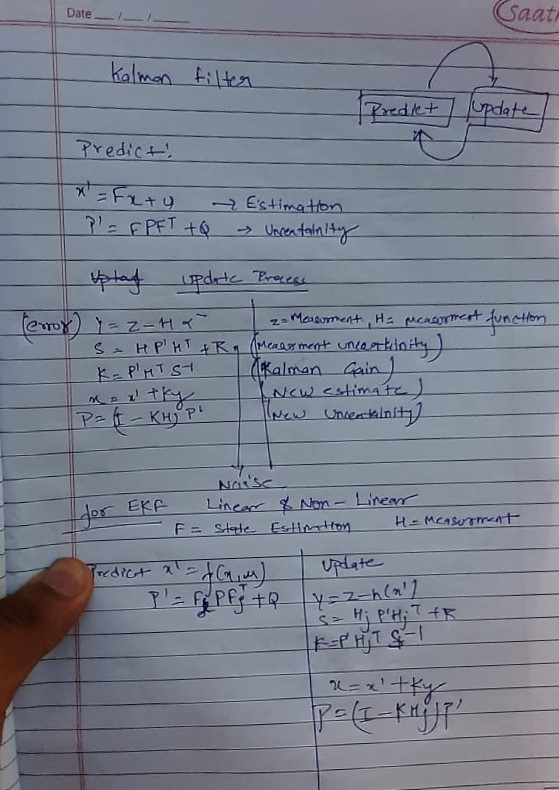

#### Udacity Self-driving Car Nanodegree
# Project 5: Extended Kalman Filter - Sensor Fusion 


## Overview
In this project we use an Extended Kalman Filter (EKF) for estimating the state of a moving object from Lidar and Radar sensor measurements. The state vector is the 2D position and velocity of the car $X = (px, py, vx, vy)^T$ of the object. Following image shows an example result of the estimate: 



In the image above, the green triangles show the estimated state, the red circles are Lidar measurements $(m_px, m_py)$ and the blue circles show Radar measurements (range, bearing, and range rate) $(m_roh, m_phi, m_roh_dot)$ an arrow (inside blue circle) pointing in the direction of the observed bearing.

Our goal is to use Kalman Filter (for Lidar measurement) and Extended Klaman Filter (for Radar measurement) to estimate the state (position and velocity), with RMSE less that a given upper bound and as low as possible. 

The project uses [Udacity's Term 2 Simulator](https://github.com/udacity/self-driving-car-sim/releases) for generating the simulated measurements and presenting the result of EKF estimate. The simulator generates the sensor measurments data and ground truth with the following format: 

* #L(for laser) meas_px meas_py timestamp gt_px gt_py gt_vx gt_vy
* #R(for radar) meas_rho meas_phi meas_rho_dot timestamp gt_px gt_py gt_vx gt_vy

The data is generated using a [matlab script]((https://github.com/udacity/CarND-Mercedes-SF-Utilities)) and an example data can be find in [this file](./data/obj_pose-laser-radar-synthetic-input.txt). 

The simulator sends each line of measurement over a WebSocket connection to our code. The Extended Kalman Filter is implemented in the `FusionEKF` class. The `main()` method prepares a `measurement_package` from the input of the simulator (coming over the WebSocket) and calls `fusionEKF.ProcessMeasurement(meas_package)`. The RMSE is then calculated from the result of state estimation and the ground truth and the estimated state and the RMSE values for position and velocity are returned to the simulator for presentation. 

The overall flow of the sensor fusion with KF and EKF is shown below: 



If the incoming measurement is the very first one, the state vector is initialized. Other matrices are initialized in the constructor of the `FusionEKF` class: state transition function `F`, process covariance matrix `P`, measurement function `H` and measurement covariance matrix `R_laser` for Lidar measurements, and the measurement covariance matrix `R_radar` for radar measurements). The measurement function `h(x)` for Radar is nonlinear. So its Jacobian has be calculated for the EKF at each step. 

For the consequent measurements the Prdict-Update cycle of the Kalman filter is performed: 

* First at the Predict step, the $\Delta t$ time between the measurements are used to calculated teh new state transition function (`F`) and process covariance matrix (`Q`). We consider no control input ($u = 0$).


* Then at the Measurement Update step for Radar the Jacobian of the radar measurement updated function is calculated and then  `UpdateEKF()` (extended Kalman filter) is called; or for Lidar measurements simply the `Update()` (Kalman filter) is called: 

```cpp
  if (measurement_pack.sensor_type_ == MeasurementPackage::RADAR) {
    // Radar updates
    ekf_.R_ = R_radar_;
    ekf_.H_ = tools.CalculateJacobian(ekf_.x_);
    ekf_.UpdateEKF(measurement_pack.raw_measurements_);

  } else {
    // Lidar updates
    ekf_.R_ = R_laser_;
    ekf_.H_ = H_laser_;
    ekf_.Update(measurement_pack.raw_measurements_);
  }
```

<!-- {height=200px width=200px} -->


## Setup and Build

This repository includes two files that can be used to set up and install [uWebSocketIO](https://github.com/uWebSockets/uWebSockets) for either Linux or Mac systems.

Once the install for uWebSocketIO is complete, the main program can be built and run by doing the following from the project top directory.
```
1. mkdir build
2. cd build
3. cmake ..
4. make
5. ./ExtendedKF
```

Here is the main protocol that main.cpp uses for uWebSocketIO in communicating with the simulator.

```
**INPUT**: values provided by the simulator to the c++ program

["sensor_measurement"] => the measurement that the simulator observed (either lidar or radar)


**OUTPUT**: values provided by the c++ program to the simulator

["estimate_x"] <= kalman filter estimated position x

["estimate_y"] <= kalman filter estimated position y

["rmse_x"]

["rmse_y"]

["rmse_vx"]

["rmse_vy"]
```


